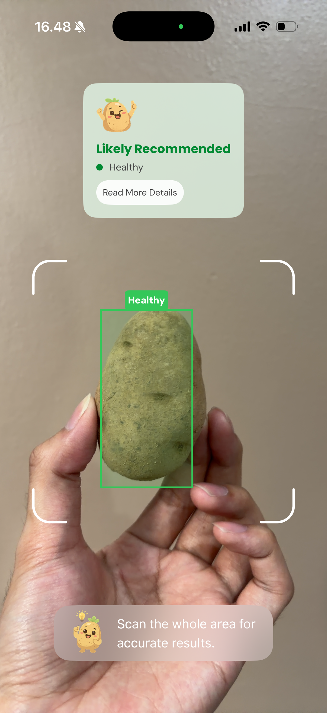

# BuDe

BuDe is an iOS application designed to analyze the quality and condition of food ingredients in real-time. By leveraging on-device machine learning and the device's camera, the app detects ingredients, categorizes their health status, and provides actionable handling tips.

  

## Core Features

* Real-Time Object Detection: Utilizes AVFoundation and the Vision framework to scan potatoes directly from the live camera feed.
* Condition Classification: Identifies healthy potatoes as well as common defects such as Black Scurf, Common Scab, Sprouted, Green Patches, and Soft Rot.
* Dynamic Bounding Boxes: Draws colored bounding boxes over detected potatoes in the live feed (green for safe to eat, red for not recommended).
* Contextual Handling Tips: Provides specific storage and preparation advice based on the aggregated conditions of the scanned potatoes (e.g., all safe, all dangerous, or a mixed batch).
* Image Masking: Extracts and displays masked images of the scanned subjects for closer inspection in the detail view.

## Machine Learning
* We utilized the Yolov11n pre-trained model as the base for our live object detection feature. To scope down our project due to our time contraint, we have conducted fine-tuning using an annotated potato dataset made by ourselves, which consists of potato images with 6 classes of bounding boxes annotated on the image. The dataset can be accessed from here ( https://universe.roboflow.com/school-5b2wl/my-first-project-yytb5/browse?queryText=&pageSize=50&startingIndex=0&browseQuery=true ).

## Technology Stack

* Language: Swift
* User Interface: SwiftUI
* Camera Integration: AVFoundation
* Machine Learning: CoreML & Vision

## Project Structure

The project follows a feature-based architecture:

* /Features/Scan: Contains the main camera interface, bounding box rendering logic, and the ScanViewModel which processes incoming camera frames through the machine learning model.
* /Features/Details: Contains the views and view models that present the scan results, lists the detected conditions, and calculates the dynamic handling tips based on the batch.
* /Shared/Models: Defines the core data structures, including the potato definitions and the global handling tips logic.
* /Shared/Utils: Contains shared UI tokens, custom color definitions, and typography settings used throughout the application.

## Requirements

* iOS 17.0+
* Xcode 15.0+
* Physical iOS device (required for live camera scanning functionality)
